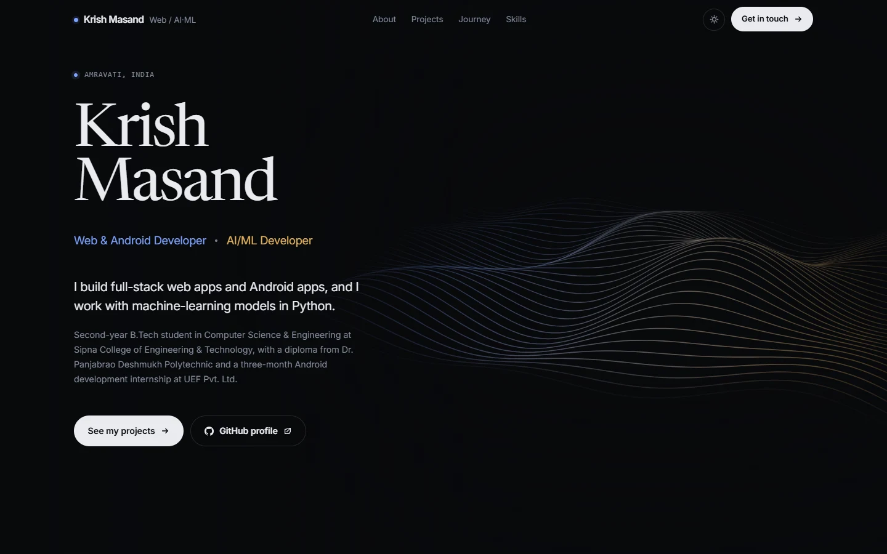

# Krish Masand — Portfolio

[](https://krishmasand7.github.io)
[](https://github.com/KrishMasand7/krishmasand7.github.io/actions/workflows/build.yml)

Personal portfolio of **Krish Masand**, a B.Tech Computer Science & Engineering student at
Sipna College of Engineering & Technology, Amravati. I build web and Android apps, and I work
with machine learning in Python.

**→ [krishmasand7.github.io](https://krishmasand7.github.io)**

[](https://krishmasand7.github.io)

---

## What's on the site

| Section | Contents |
| --- | --- |
| **About** | Who I am, where I study, and the two sides of my work: web & Android, and AI/ML |
| **Projects** | FixMyCity (Android civic-complaints app), Task Manager (Node.js, Express, MongoDB), Amazon Homepage Clone (HTML & CSS) |
| **Journey** | B.Tech at Sipna College, Android development internship at UEF Pvt. Ltd., diploma from Dr. Panjabrao Deshmukh Polytechnic |
| **Skills** | Languages, frontend, backend & databases, Android, machine learning, core CS, tools |
| **Contact** | Email, GitHub and LinkedIn |

## Features

- **Dark and light themes.** Follows the device setting; the toggle in the nav overrides it and is remembered.
- **Animated hero.** A rolling 3D wave of lines drawn on a canvas, shading from blue (web) to gold (ML). It pauses when scrolled out of view and is skipped on phones and for anyone with reduced motion turned on.
- **Colour with meaning.** Blue marks web and Android work, gold marks AI/ML, across the whole page.
- **Email that always works.** If a visitor's device has no email app, "Email me" offers Gmail and Outlook compose links and copies the address.
- **Works without JavaScript.** Every section is readable and every project panel is open with scripts off.
- **Small and fast.** About 15 kB of HTML (gzipped), 24 kB of JavaScript, self-hosted fonts, and no third-party requests.

## Built with

- HTML, CSS and JavaScript — no framework and no npm dependencies
- A single Node.js build script (`build.mjs`) that renders the page from content files
- Canvas 2D for the hero animation
- GitHub Pages for hosting, GitHub Actions to check every push

---

## Run it locally

Needs [Node.js](https://nodejs.org) 20 or newer. There is nothing to install.

```bash
git clone https://github.com/KrishMasand7/krishmasand7.github.io.git
cd krishmasand7.github.io
npm run serve
```

Then open <http://localhost:4321>.

## Updating the content

Everything the page says lives in two files:

| File | What to edit there |
| --- | --- |
| `src/content/profile.mjs` | name, roles, links, hero text, About section, photo |
| `src/content/work.mjs` | projects, journey, honours, certifications, skills, contact text |

1. Edit one of those files.
2. Run `npm run build`.
3. Commit and push. The live site updates within a minute or two.

```bash
git add -A
git commit -m "Update portfolio"
git push
```

A few things happen automatically:

- The hero's "technologies" and "projects" counts are worked out from the lists.
- Adding the first entry to `honours` makes an Honours section and nav link appear.
- Adding an entry to `certifications` shows it under the journey.

Don't edit `index.html`, `404.html` or `assets/` directly; they are regenerated on every build.

## Commands

| Command | What it does |
| --- | --- |
| `npm run build` | Build the site once |
| `npm run dev` | Rebuild whenever `src/` changes |
| `npm run serve` | Build, then preview at http://localhost:4321 |
| `npm run check` | Build, then run the static checks |
| `npm run links` | Check every external link (needs internet) |
| `npm run portraits` | Cut the photo in `src/photos/` out of its background (needs Chrome or Edge) |
| `npm run icons` | Regenerate the social preview image and icons (needs Chrome or Edge) |

## Project structure

```
build.mjs               the build — reads src/, writes the site to the repository root
serve.mjs               local preview server
src/
  content/              profile.mjs and work.mjs — every fact on the page
  templates/page.mjs    turns the content into index.html
  styles/               CSS, inlined at build time; all colours live in 01-tokens.css
  scripts/main.js       theme, navigation, animations, project panels, email fallback
  scripts/wave.js       the hero animation
  photos/               original photo (input to make-portraits)
  static/               fonts and generated images
scripts/
  verify.mjs            static checks on the built site
  check-links.mjs       external link checker
  make-portraits.mjs    removes the background from the portrait photo
  make-icons.mjs        renders og.png, favicon.ico and apple-touch-icon.png
  chrome.mjs            small headless-Chrome helper used by the two scripts above
```

### Changing the photo

Replace `src/photos/portrait-studio.jpg` with a photo taken against a plain, light background,
run `npm run portraits`, and copy the size it prints into `w` and `h` under `portraits.studio`
in `src/content/profile.mjs`.

## Deployment

GitHub Pages serves this repository from the `main` branch, root folder. The built site is
committed, so pushing to `main` publishes it; `.nojekyll` stops GitHub from reprocessing the files.

The **Build** workflow in `.github/workflows/build.yml` doesn't deploy. It rebuilds the site on
every push and fails if the committed files don't match, so remember to run `npm run build`
before committing.

---

## Credits

- Fonts: [Inter](https://rsms.me/inter/) and [Newsreader](https://github.com/productiontype/Newsreader), under the SIL Open Font License.

## Contact

- Email: [krishmasand7@gmail.com](mailto:krishmasand7@gmail.com)
- LinkedIn: [in/krish-masand-63264727a](https://www.linkedin.com/in/krish-masand-63264727a/)
- GitHub: [@KrishMasand7](https://github.com/KrishMasand7)
